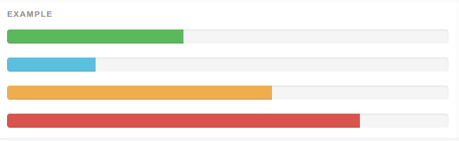

rails-bootstrap-progressbar
===========================


## description

Bootstrap_progressbar will make it super easy to create beautiful-looking [progress bar](http://getbootstrap.com/components/#progress) in rails using Bootstrap 3

## require

Rails 4.0+

Bootstrap 3+ (you can install with [twbs/bootstrap-sass](https://github.com/twbs/bootstrap-sass))

## install

add below line to your Gemfile:

> gem 'bootstrap_progressbar'

and then `bundle install`

## usage

#### Basic example

Default progress bar.


```
<%= progress_bar 0.6 %>
=> <div class="progress"><div class="progress-bar" role="progressbar" aria-valuenow="60" aria-valuemin="0" aria-valuemax="100" style="width: 60%;"><span class="sr-only">60% Complete</span></div></div>
```
#### With label

Remove the .sr-only class from within the progress bar to show a visible percentage. For low percentages, consider adding a min-width to ensure the label's text is fully visible.


```
<%= progress_bar 0.6, label: true, style: 'min-width: 20px' %>
=> <div class="progress" style="min-width: 20px"><div class="progress-bar" role="progressbar" aria-valuenow="60" aria-valuemin="0" aria-valuemax="100" style="width: 60%;">60%</div></div>
```

#### Low percentages

Progress bars representing low single digit percentages, as well as 0%, include a min-width: 20px; for legibility.


```
<%= progress_bar 0.2, label: true, style: 'min-width: 20px' %>
<%= progress_bar 0, label: true, style: 'min-width: 20px' %>

=> <div class="progress" style="min-width: 20px"><div class="progress-bar" role="progressbar" aria-valuenow="0" aria-valuemin="0" aria-valuemax="100">0%</div></div>
<div class="progress" style="min-width: 20px"><div class="progress-bar" role="progressbar" aria-valuenow="2" aria-valuemin="0" aria-valuemax="100" style="width: 2%;">2%</div></div>
```

#### Contextual alternatives

Progress bars use some of the same button and alert classes for consistent styles.



```
<%= progress_bar 0.4, alternative: 'success' %>
<%= progress_bar 0.2, alternative: 'info' %>
<%= progress_bar 0.6, alternative: 'warning' %>
<%= progress_bar 0.8, alternative: 'danger' %>

=> <div class="progress"><div class="progress-bar progress-bar-success" role="progressbar" aria-valuenow="40" aria-valuemin="0" aria-valuemax="100" style="width: 40%"><span class="sr-only">40%</span></div></div>

<div class="progress"><div class="progress-bar progress-bar-info" role="progressbar" aria-valuenow="20" aria-valuemin="0" aria-valuemax="100" style="width: 20%"><span class="sr-only">20%</span></div></div>

<div class="progress"><div class="progress-bar progress-bar-warning" role="progressbar" aria-valuenow="60" aria-valuemin="0" aria-valuemax="100" style="width: 60%"><span class="sr-only">60%</span></div></div>

<div class="progress"><div class="progress-bar progress-bar-danger" role="progressbar" aria-valuenow="80" aria-valuemin="0" aria-valuemax="100" style="width: 80%"><span class="sr-only">80%</span></div></div>
```

#### Striped

Uses a gradient to create a striped effect. Not available in IE8.


```
<%= progress_bar 0.4, alternative: 'success', striped: true %>
<%= progress_bar 0.2, alternative: 'info', striped: true  %>
<%= progress_bar 0.6, alternative: 'warning', striped: true  %>
<%= progress_bar 0.8, alternative: 'danger', striped: true  %>

=> <div class="progress"><div class="progress-bar progress-bar-success progress-bar-striped" role="progressbar" aria-valuenow="40" aria-valuemin="0" aria-valuemax="100" style="width: 40%"><span class="sr-only">40%</span></div></div>

<div class="progress"><div class="progress-bar progress-bar-info progress-bar-striped" role="progressbar" aria-valuenow="20" aria-valuemin="0" aria-valuemax="100" style="width: 20%"><span class="sr-only">20%</span></div></div>

<div class="progress"><div class="progress-bar progress-bar-warning progress-bar-striped" role="progressbar" aria-valuenow="60" aria-valuemin="0" aria-valuemax="100" style="width: 60%"><span class="sr-only">60%</span></div></div>

<div class="progress"><div class="progress-bar progress-bar-danger progress-bar-striped" role="progressbar" aria-valuenow="80" aria-valuemin="0" aria-valuemax="100" style="width: 80%"><span class="sr-only">80%</span></div></div>
```

#### Animated

Add .active to .progress-bar-striped to animate the stripes right to left. Not available in IE9 and below.


```
<%= progress_bar 0.45, alternative: 'success', active: true  %>
=> <div class="progress"><div class="progress-bar progress-bar-success progress-bar-striped active" role="progressbar" aria-valuenow="45" aria-valuemin="0" aria-valuemax="100" style="width: 45%"><span class="sr-only">45%</span></div></div>
```

#### Stacked

Place multiple bars into the same .progress to stack them.


```
<div class="progress">
    <%= simple_progress_bar 0.35, alternative: 'success' %>
    <%= simple_progress_bar 0.20, alternative: 'warning' %>
    <%= simple_progress_bar 0.10, alternative: 'danger' %>
</div>

=> <div class="progress">
    <div class="progress-bar progress-bar-success" role="progressbar" aria-valuenow="35" aria-valuemin="0" aria-valuemax="100" style="width: 35%"><span class="sr-only">35%</span></div>
    <div class="progress-bar progress-bar-warning" role="progressbar" aria-valuenow="20" aria-valuemin="0" aria-valuemax="100" style="width: 20%"><span class="sr-only">20%</span></div>
    <div class="progress-bar progress-bar-danger" role="progressbar" aria-valuenow="10" aria-valuemin="0" aria-valuemax="100" style="width: 10%"><span class="sr-only">10%</span></div>
</div>
```

#### define id or more classes

By giving :id, you can define an id for '.progress' element(using progress_bar) or '.progress-bar' element(using simple_progress_bar)
By giving :class, you can prepend the classed to '.progress' element or '.progress-bar' element.

```
<%= progress_bar 0.6, id: 'progress', class: 'something' %>
=> <div class="progress" id='progress'><div class="something progress-bar" role="progressbar" aria-valuenow="60" aria-valuemin="0" aria-valuemax="100" style="width: 60%;"><span class="sr-only">60% Complete</span></div></div>
```

```
<%= simple_progress_bar 0.6, id: 'progress', class: 'something' %>
=> <div class="progress" id='progress'><div class="something progress-bar" role="progressbar" aria-valuenow="60" aria-valuemin="0" aria-valuemax="100" style="width: 60%;"><span class="sr-only">60% Complete</span></div></div>
```

## run the test

To init environment:

    $ cd test/dummy && bundle exec rake RAILS_ENV=test && cd ../../

Then you can:

    $ bundle exec rake test

